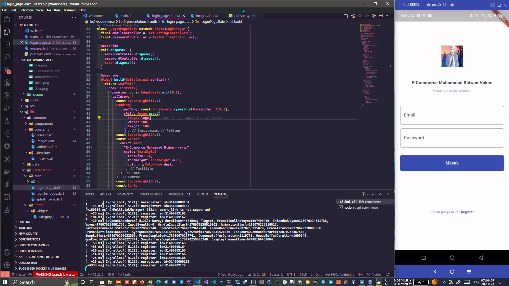
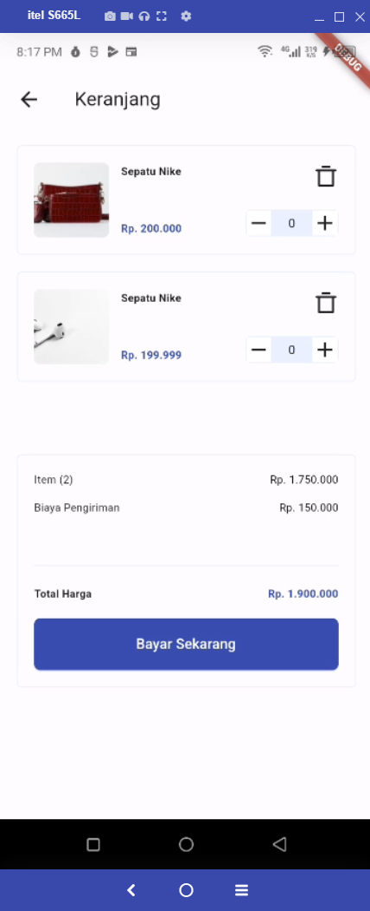

# fic9-ecommerce

## Muhammad Ridwan Hakim, S.T.

#### Task 3 : Login Page

## 💖 Login Page
### Frontend Flutter: 

## 💖 Dashboard Payment Callbacks
### Strapi Backend: https://github.com/rescenic/strapi-ecommerce

## 💖 Task 4 :
1. Simpan user data di flutter local storage dengan shared_preferences 
2. Integration API list Product 
3. Implement Product detail 
4. Implement Logic Add Remove Cart dengan Flutter Bloc 

